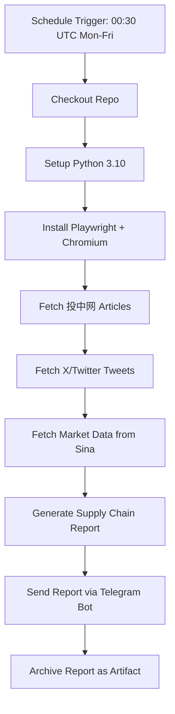

# GitHub Actions 免费部署 — 实施计划

## 1. 系统依赖分析

| 组件 | 依赖 | 云端适配方案 |
|------|------|-------------|
| `fetch_chinaventure.py` | Playwright + Chromium | `pip install playwright && playwright install chromium` |
| `fetch_x_recent.py` | X_BEARER_TOKEN（已支持 env var） | GitHub Secrets → 环境变量 |
| `fetch_market_sina.py` | 无外部依赖 | 直接运行 |
| `supply_chain_report.py` | 静态数据文件 + 运行时数据 | 静态文件 git commit，运行时文件 workflow 内生成 |
| `telegram_bot.py` | TELEGRAM_BOT_TOKEN + TELEGRAM_CHAT_ID（已支持 env var） | GitHub Secrets → 环境变量 |
| `requirements.txt` | 纯 Python 标准库 | 仅需额外安装 `playwright` |

## 2. 文件清单

### 需修改的文件

| 文件 | 修改内容 |
|------|---------|
| `scripts/daily_report_cloud.sh` | **新建** — GitHub Actions 版 pipeline 脚本 |
| `.github/workflows/daily_report.yml` | **新建** — GitHub Actions 工作流定义 |
| `src/fetch_x_recent.py` | 无需修改（已支持 `os.environ.get("X_BEARER_TOKEN")`） |
| `src/telegram_bot.py` | 无需修改（已支持 `os.environ.get()`） |
| `.gitignore` | 无需修改 |

### 需确保已 git commit 的静态数据文件
- `data/stock_aliases.csv` ✅
- `data/supply_chain.csv` ✅
- 代码目录全部 ✅

## 3. GitHub Actions 工作流设计



### 工作流配置要点

```yaml
name: Daily A-Share Report

on:
  schedule:
    # 08:30 Beijing = 00:30 UTC (weekdays only)
    - cron: '30 0 * * 1-5'
  workflow_dispatch:  # 支持手动触发

jobs:
  report:
    runs-on: ubuntu-latest
    steps:
      - uses: actions/checkout@v3

      - uses: actions/setup-python@v4
        with:
          python-version: '3.10'

      - name: Install Playwright
        run: |
          pip install playwright
          python -m playwright install chromium

      - name: Fetch 投中网 articles
        run: |
          python src/fetch_chinaventure.py \
            --date "$(date -u -d '+8 hours' +%Y-%m-%d)" \
            --out data/chinaventure_articles.csv

      - name: Fetch X tweets
        env:
          X_BEARER_TOKEN: ${{ secrets.X_BEARER_TOKEN }}
        run: |
          python src/fetch_x_recent.py \
            --query "(A股 OR 股市) -is:retweet lang:zh" \
            --out data/real_tweets.csv \
            --max-results 100

      - name: Fetch market data
        run: |
          TODAY=$(date -u -d '+8 hours' +%Y-%m-%d)
          # Fetch last 90 trading days
          python src/fetch_market_sina.py \
            --start "$(date -u -d '+8 hours -6 months' +%Y-%m-%d)" \
            --end "$TODAY" \
            --out data/real_market_full.csv \
            --datalen 90

      - name: Generate report
        run: |
          TODAY=$(date -u -d '+8 hours' +%Y-%m-%d)
          python src/supply_chain_report.py \
            --date "$TODAY" \
            --tweets data/real_tweets.csv \
            --exclude-prefixes "688,300" \
            --out "reports/supply_chain_report_${TODAY}.md"

      - name: Send to Telegram
        env:
          TELEGRAM_BOT_TOKEN: ${{ secrets.TELEGRAM_BOT_TOKEN }}
          TELEGRAM_CHAT_ID: ${{ secrets.TELEGRAM_CHAT_ID }}
        run: |
          TODAY=$(date -u -d '+8 hours' +%Y-%m-%d)
          python src/telegram_bot.py \
            "reports/supply_chain_report_${TODAY}.md" \
            --title "📊 A股产业链早盘报告 · $TODAY" \
            --full

      - name: Upload report artifact
        uses: actions/upload-artifact@v3
        with:
          name: daily-report
          path: reports/supply_chain_report_*.md
```

## 4. GitHub Secrets 配置

需要在 GitHub 仓库 Settings → Secrets and variables → Actions 中添加：

| Secret Name | 对应 .env 值 | 说明 |
|-------------|-------------|------|
| `X_BEARER_TOKEN` | `X_BEARER_TOKEN` | X API Bearer Token |
| `TELEGRAM_BOT_TOKEN` | `TELEGRAM_BOT_TOKEN` | Telegram Bot Token |
| `TELEGRAM_CHAT_ID` | `TELEGRAM_CHAT_ID` | 逗号分隔的 Chat IDs |

## 5. 实施步骤

### Step 1: 创建 `.github/workflows/daily_report.yml`
- 定义 schedule 为 `30 0 * * 1-5`（北京时间 08:30，周一到周五）
- 支持 `workflow_dispatch` 手动触发
- 使用 `actions/checkout@v3` 和 `actions/setup-python@v4`
- 安装 Playwright Chromium

### Step 2: 创建 `scripts/daily_report_cloud.sh`（可选）
- GitHub Actions 版适配脚本（可直接在 workflow 中 inline，为清晰起见单独脚本）

### Step 3: 验证 `fetch_x_recent.py` 的环境变量支持
- 当前实现：`parser.add_argument("--bearer-token", default=os.environ.get("X_BEARER_TOKEN", "") or load_env_token(base_dir))` ✅
- 已经在 GitHub Actions 中正常工作

### Step 4: 创建 GitHub Repository 并推送
- `git init`（如果尚未初始化）
- `git add .`
- `git commit -m "Initial commit: A-stock supply chain recommendation system"`
- `git remote add origin https://github.com/<user>/a-stock-sentiment.git`
- `git push -u origin main`

### Step 5: 配置 GitHub Secrets
- 在 GitHub 仓库 Settings → Secrets and variables → Actions → New repository secret
- 依次添加 3 个 Secrets

### Step 6: 手动触发测试
- 在 GitHub Actions 页面点击 "Run workflow" → "Run now"
- 观察执行日志，确保每个步骤成功

## 6. 注意事项

### Playwright 在 GitHub Actions 中的兼容性
- `playwright install chromium` 在 ubuntu-latest 上自动安装 Chromium 及其依赖
- 无需额外安装系统级依赖（Playwright 会自动处理）
- `fetch_chinaventure.py` 默认 headless=True，CI 环境无头模式完美兼容

### 时间处理
- GitHub Actions runner 默认 UTC 时区
- 北京时间 = UTC + 8 小时
- `date -u -d '+8 hours' +%Y-%m-%d` 获取北京时间日期

### 错误处理
- `fetch_chinaventure.py` 有 `|| true` 容错（workflow 中应继续执行）
- 可以在 workflow 中添加 `continue-on-error: true` 或 if 条件判断
- 报告生成和 Telegram 推送是最关键的步骤

### 费用
- GitHub Actions 免费额度：每月 2000 分钟
- 每次运行约 3-5 分钟
- 每月约 20 个工作日 → 60-100 分钟/月
- 完全在免费额度内 ✅

## 7. 风险与缓解措施

| 风险 | 缓解措施 |
|------|---------|
| 投中网反爬（Playwright 被检测） | `fetch_chinaventure.py` 有 `|| true` 容错，无文章也能出报告 |
| X API 限流 | `--max-results 100` 控制请求量，失败则 social_stats 为空 |
| Sina 行情接口不稳定 | `--retries 3` 自动重试 |
| GitHub Actions 偶发失败 | 支持 `workflow_dispatch` 手动重跑 |
| 周末不交易但工作日有节假日 | schedule 只配了 Mon-Fri，法定节假日需手动跳过或忽略空报告 |
