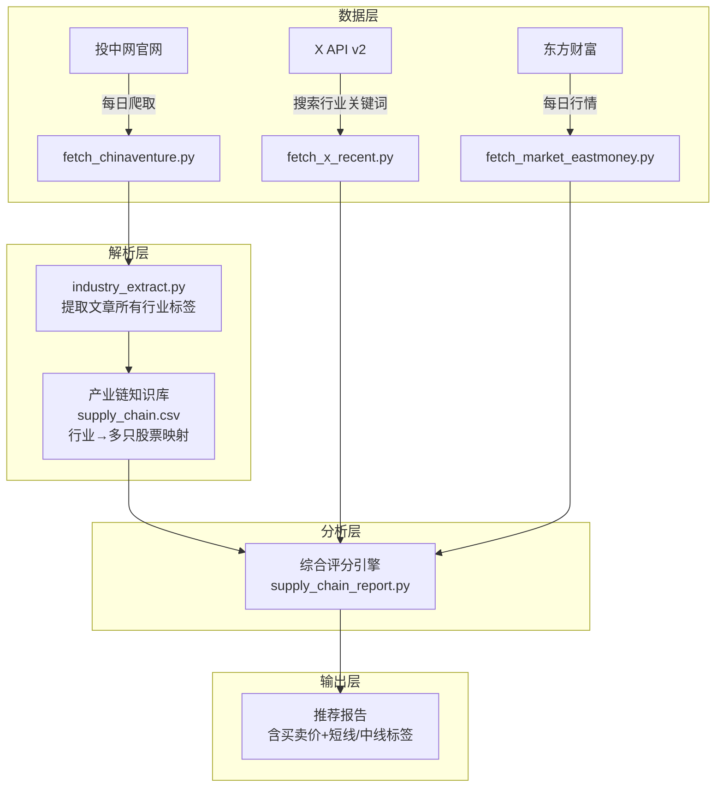

# 投中网 · A股全行业产业链推荐系统

## 需求总结

1. **输入**：投中网每日文章，提取文章涉及的所有行业
2. **匹配**：每个行业映射到对应的 A 股产业链股票
3. **分析**：结合 X 情绪 + 热度 + 技术指标
4. **输出**：买入价、预期卖出价、短线/中线推荐标签

---

## 系统架构



---

## 产业链知识库设计

### 覆盖行业（初期）

| 行业 | 代表股票 | 覆盖数量 |
|------|---------|:--------:|
| 先进封装/封测 | 长电科技、通富微电、华天科技、晶方科技 | 6 |
| 半导体设备 | 北方华创、中微公司、拓荆科技、长川科技、华峰测控 | 6 |
| 半导体材料 | 雅克科技、鼎龙股份、安集科技、晶瑞电材、沪硅产业 | 6 |
| 存储芯片 | 兆易创新、北京君正、澜起科技、江波龙 | 4 |
| AI芯片/算力 | 寒武纪、海光信息、景嘉微、中科曙光 | 4 |
| 功率半导体 | 斯达半导、士兰微、时代电气、新洁能 | 4 |
| 消费电子 | 立讯精密、歌尔股份、韦尔股份、蓝思科技 | 4 |
| 新能源车 | 比亚迪、赛力斯、拓普集团、三花智控 | 4 |
| 锂电池 | 宁德时代、亿纬锂能、璞泰来、恩捷股份 | 4 |
| 光伏储能 | 隆基绿能、阳光电源、通威股份、天合光能 | 4 |
| 人工智能 | 科大讯飞、金山办公、中科创达、商汤 | 4 |
| 机器人 | 绿的谐波、鸣志电器、汇川技术、禾川科技 | 4 |
| 医药创新 | 恒瑞医药、百济神州、药明康德、凯莱英 | 4 |

### 知识库 CSV 格式

```csv
industry,code,name,role,aliases,industry_group
先进封装,600584,长电科技,封测龙头,"长电科技|JCET",半导体
先进封装,002156,通富微电,封测第二,"通富微电|TFME",半导体
半导体设备,002371,北方华创,刻蚀/薄膜/清洗,"北方华创|NAURA",半导体
半导体设备,688012,中微公司,刻蚀设备,"中微公司|AMEC",半导体
存储芯片,603986,兆易创新,存储芯片设计,"兆易创新|GigaDevice",半导体
锂电池,300750,宁德时代,电池龙头,"宁德时代|CATL",新能源
```

---

## 短线 vs 中线判断逻辑

### 短线推荐条件（持有1-5天）
```
短线评分 = X情绪分×0.35 + 热度放大倍数×0.25 + 量能倍数×0.20 + RSI动量×0.10 + 开盘位置×0.10
```

| 条件 | 短线加分 | 短线减分 |
|------|---------|---------|
| X 情绪 | 正面（>0.25） | 负面（<-0.25） |
| 热度比 | >2x（突然变热） | <0.5x（热度消退） |
| 量能 | >1.2x（放量） | <0.8x（缩量） |
| RSI | 30-60（非超买非超卖） | >80（超买风险） |
| 开盘涨幅 | -1% 到 +4% | 高开>4% 或低开<-3% |

### 中线推荐条件（持有1-4周）
```
中线评分 = 行业趋势×0.30 + MA均线结构×0.25 + X情绪趋势×0.15 + MACD趋势×0.15 + 量能稳定性×0.15
```

| 条件 | 中线加分 | 中线减分 |
|------|---------|---------|
| 行业趋势 | 投中网多次提及，政策利好 | 行业利空 |
| MA结构 | MA5>MA20>MA60 多头排列 | MA5<MA20<MA60 空头排列 |
| X情绪趋势 | 连续多日正面 | 连续多日负面 |
| MACD | 零轴上方金叉 | 零轴下方死叉 |
| 量能 | 温和放量 | 放量滞涨/缩量下跌 |

---

## 买卖价格计算规则（A股实战经验）

### 短线买入价
```
参考买入价 = max(今日开盘价, 昨日收盘价×0.99)
```
- 原则：开盘后观察 15-30 分钟，不追高，不抄暴跌
- 如果开盘涨幅 >4%，不追入（防止冲高回落）
- 如果开盘跌幅 >3%，不抄底（可能继续下跌）

### 短线预期卖出价
```
目标涨幅 = 3.0% + max(0, X情绪分)×0.5 + 技术确认加分0.8 + 量能加分0.4
目标涨幅 = clamp(目标涨幅, 2.0%, 6.5%)  -- A股主板涨停10%，预留安全边际
预期卖出价 = 买入价 × (1 + 目标涨幅)
```

### 中线预期卖出价
```
目标涨幅 = 8.0% + MA多头排列加分2.0 + 行业热度加分2.0 + 量能稳定加分1.0
目标涨幅 = clamp(目标涨幅, 5.0%, 15.0%)  -- 中线目标放宽
预期卖出价 = 买入价 × (1 + 目标涨幅)
```

### 止损价
```
短线止损 = 买入价 × 0.97  -- 短线-3%止损
中线止损 = 买入价 × 0.93  -- 中线-7%止损
```

---

## 报告输出格式

```markdown
# 投中网行业热度 · A股产业链推荐报告
日期：2026-05-22

## 今日投中网覆盖行业
1. 先进封装（热度：🔥🔥🔥）— 1篇文章
   - 映射股票：长电科技、通富微电、雅克科技
2. 半导体设备（热度：🔥🔥）— 1篇文章
   - 映射股票：北方华创、中微公司、拓荆科技

## 推荐候选

### 🔥 短线推荐

| 排名 | 代码 | 名称 | 产业链 | 信号分 | 类型 | X热度 | X情绪 | 量能 | 参考买入价 | 预期卖出价 | 止损价 |
|:---:|:---:|:---:|:------:|:-----:|:---:|:----:|:----:|:---:|:---------:|:---------:|:-----:|

### 📈 中线推荐

| 排名 | 代码 | 名称 | 产业链 | 信号分 | 类型 | MA趋势 | X情绪 | 行业趋势 | 参考买入价 | 预期卖出价 | 止损价 |

## 逐股逻辑
...
```

---

## A股实战经验规则总结

| 规则 | 说明 |
|------|------|
| 涨停板 | 主板10%，创业板/科创板20%，推荐目标预留安全边际 |
| 量价配合 | 量在价先，放量上涨可靠，缩量上涨警惕 |
| 支撑压力 | 20日内最低=支撑，20日内最高=压力，突破压力确认趋势 |
| 均线系统 | MA5/MA20/MA60 多头排列=上升趋势，空头排列=下降趋势 |
| RSI | <30超卖(反弹机会)，>80超买(回调风险) |
| 热度确认 | X讨论突然放大2x+需要成交量确认真实性 |
| 分散度 | 单账号刷屏降权，多账号讨论加分 |
| 行业联动 | 投中网关注的行业通常有政策面/资金面逻辑支撑 |

---

## 实施步骤

| # | 步骤 | 文件 | 工作量 |
|---|------|------|:------:|
| 1 | 创建全行业产业链知识库 | `data/supply_chain.csv`（约60只股票） | 中 |
| 2 | 扩展股票别名库 | `data/stock_aliases.csv` | 中 |
| 3 | 实现投中网爬虫 | `src/fetch_chinaventure.py` | 大 |
| 4 | 实现行业关键词提取 | `src/industry_extract.py` | 中 |
| 5 | 实现综合推荐引擎（含买卖价+短线/中线） | `src/supply_chain_report.py` | 大 |
| 6 | 全链路测试 | 跑通5.22数据 | 小 |
