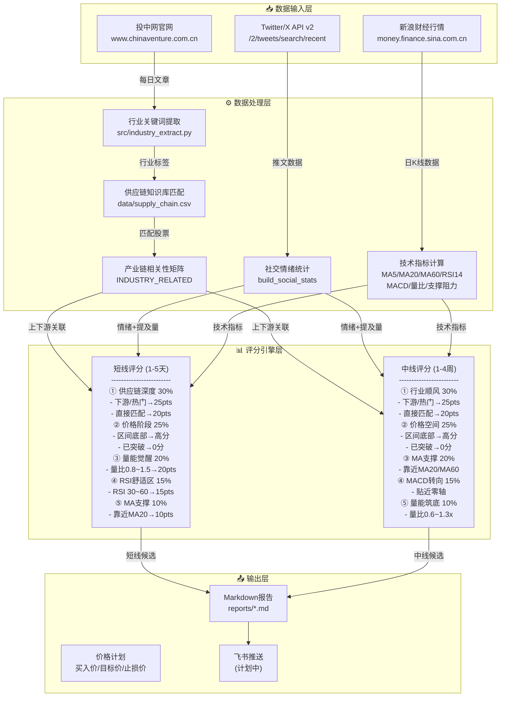

# 投中网 · A股产业链推荐系统 — 逻辑架构图



---

## 一、数据流详解

### 1️⃣ 输入层

```
投中网文章 ──┬──> 行业关键词提取 ──> 供应链匹配
             │
Twitter/X ───┼──> 股票级社交统计 ──> 情绪分 + 提及量
             │
新浪行情 ────┴──> 技术指标计算 ──> MA/RSI/MACD/量比/支撑阻力
```

### 2️⃣ 供应链知识库结构

```
data/supply_chain.csv
┌─────────────────────────────────────────────────────────┐
│ industry    │ code  │ name     │ keywords               │
├─────────────────────────────────────────────────────────┤
│ 先进封装    │ 600584│ 长电科技 │ 长电科技,封测龙头       │
│ 先进封装    │ 002156│ 通富微电 │ 通富微电,通富         │
│ 半导体设备  │ 002371│ 北方华创 │ 北方华创,华创         │
│ 半导体材料  │ 002409│ 雅克科技 │ 雅克科技,雅克         │
│ ...         │ ...   │ ...      │ ...                    │
└─────────────────────────────────────────────────────────┘
```

### 3️⃣ 产业链相关性矩阵

```
INDUSTRY_RELATED = {
    "AI芯片"    → ["先进封装", "半导体设备", "半导体材料", "存储芯片", "功率半导体"],
    "人工智能"  → ["消费电子", "半导体", "机器人"],
    "先进封装"  → ["半导体设备", "半导体材料"],
    "新能源车"  → ["锂电池", "功率半导体", "机器人"],
    "光伏储能"  → ["功率半导体", "锂电池", "新能源"],
    ...
}
```

### 4️⃣ 价格阶段评分算法

```
calc_price_stage_score(market_row, max_score=25):
    range_pos = (close - support) / (resistance - support)  # 0~1
    room_pct = (resistance - close) / close * 100            # %
    
    IF close > resistance:  return 0   # 已突破 → 太晚进场
    
    position_factor = 1.0 - range_pos   # 底部=1, 顶部=0
    room_factor     = min(1.0, room_pct / 8.0)  # 8%+空间=1
    
    score = max_score * position_factor * room_factor
```

---

## 二、评分权重总览

| 维度 | 短线权重 | 中线权重 | 说明 |
|------|:-------:|:-------:|------|
| 供应链深度/行业顺风 | **30%** | **30%** | 下游受益>直接匹配 |
| 价格阶段/价格空间 | **25%** | **25%** | 底部>顶部, 未突破 |
| 量能觉醒/MA支撑 | **20%** | **20%** | 温和放量 |
| RSI舒适区/MACD转向 | **15%** | **15%** | 30~60 / 近零轴 |
| MA支撑/量能筑底 | **10%** | **10%** | 靠近均线 / 缩量 |

---

## 三、价格计划

| 类型 | 买入价 | 目标涨幅 | 止损 |
|:---:|:------:|:--------:|:---:|
| 短线 | 收盘价×0.99 | +3%~8% | -3% |
| 中线 | min(收盘价, MA20) | +8%~20% | -7% |

---

## 四、命令行接口

```bash
# 完整运行
PYTHONPATH=src python3 src/supply_chain_report.py \
  --date 2026-05-22 \
  --market-date 2026-05-21 \    # 盘前用前一日收盘
  --tweet-date 2026-05-22 \     # 推特数据日期
  --out reports/report.md

# 指定博主过滤
PYTHONPATH=src python3 src/supply_chain_report.py \
  --date 2026-05-22 \
  --authors "44196397,14236520"
```
